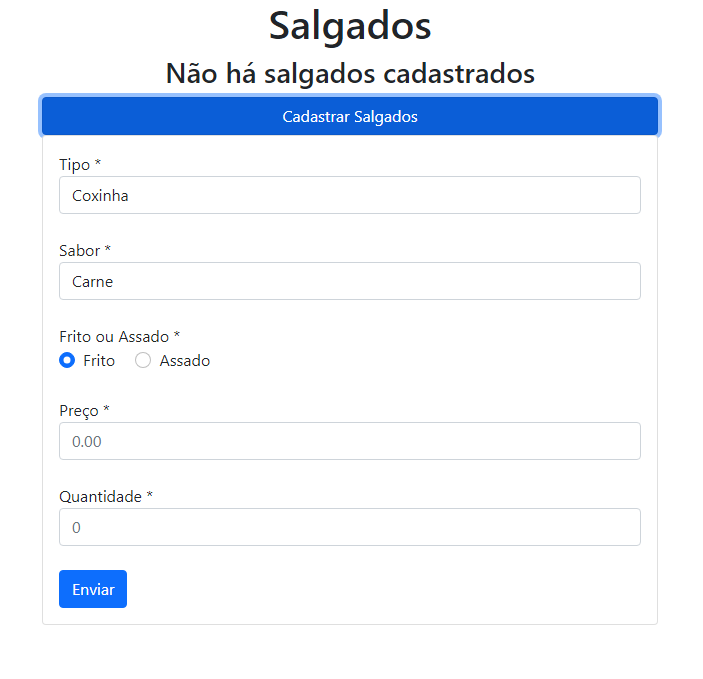
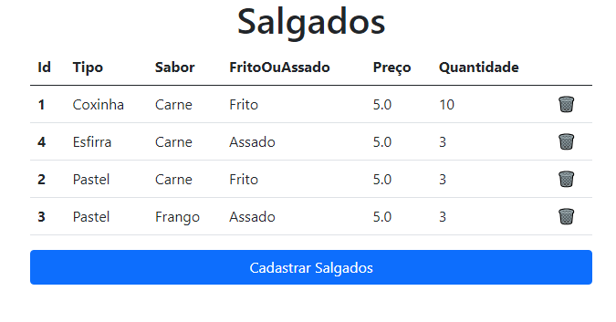

# festaJunina-SpringBoot
Projeto da matéria de Desenvolvimento de Aplicações Web do meu curso. 
Basicamente é um gerenciador de estoque de uma barraca de salgados de uma festa junina.
O projeto foi inicialmente feito com JavaServerFaces, mas foi atualizado para SpringBoot e Thymeleaf.

